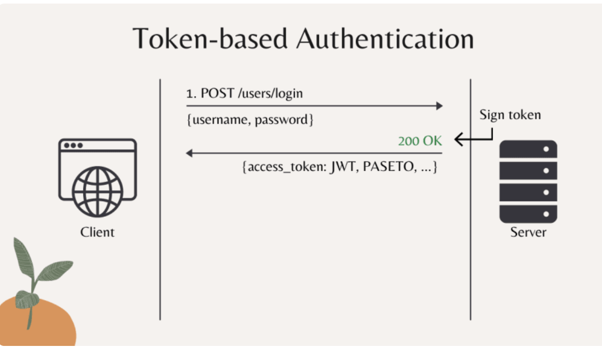
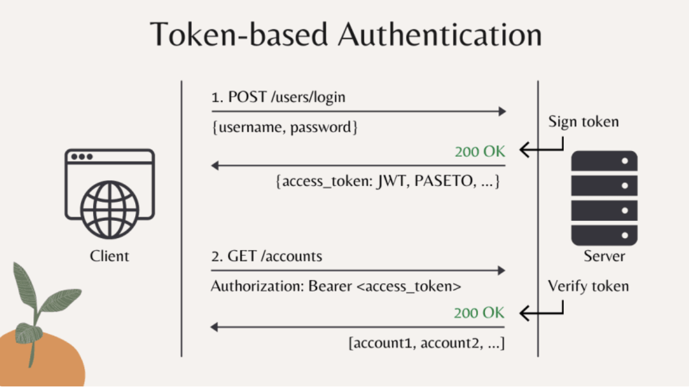
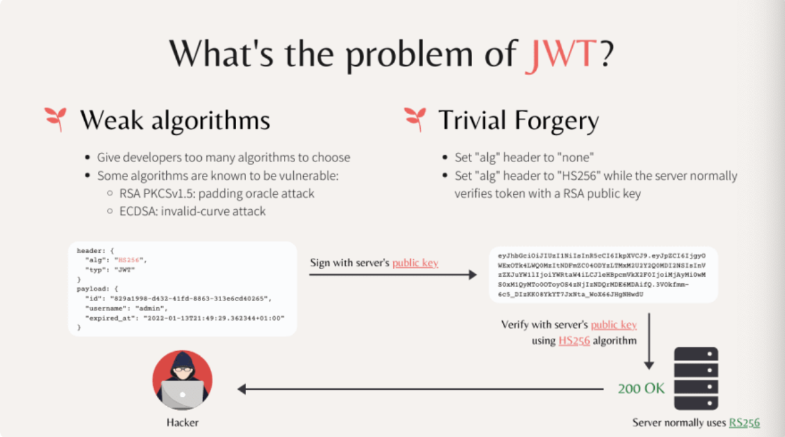
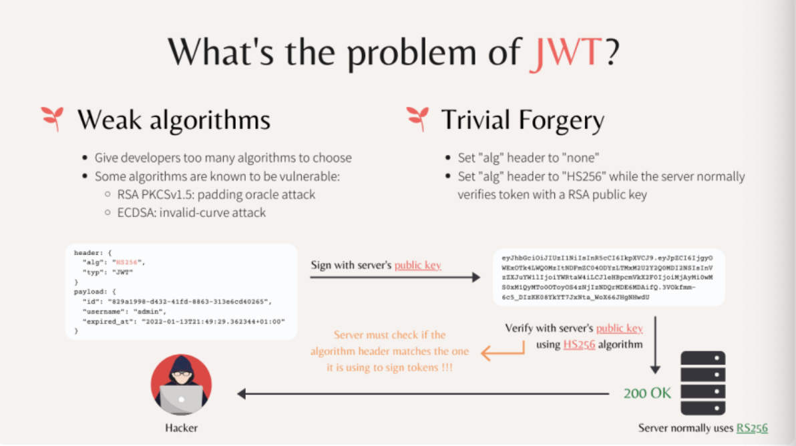

# Pre
1. Install golang-migrate with command 
```
brew install golang-migrate
```
2. Install docker to setup database locally

3. Install SQLC 
```
brew install sqlc
```
4. After install sqlc successfully, go to root folder and run 
```
sqlc init
```
5. To execute test we using golang postgres driver
```
go get github.com/lib/pq
```
6. testify 
```
go get github.com/stretchr/testify
```
# DB 
1. Using postgresql
2. Using SQLC
* Very fast & easy to use
* Automatic code generation
* Catch SQL query errors before generating codes
* Full support Postgres. MySQL is experimental
3. Why we don't use GORM? 
* CRUD functions already implemented, very short production code
* Must learn to write queries using GORM's function
* Run slowly on high load
4. Why we don't use SQLX?
* Quite fast & easy to use
* Fields mapping via query text & structure tags
* Failure won't occur until runtime
5. Why we don't use database/sql?
* Very fast & straightforward
* Manual mapping SQL fields to variables
* Easy to make mistakes, not caught until runtime
6. 
* To execute test we using golang postgres driver
* Using testify to support run Unit test
7. Implement database transactions in Golang? What is ACID of database transactions.
* Atomicity (A): Either all operations complete successfully or the transaction fails and the db is unchanged
* Consistency (C): The db state must be valid after the transaction. All constraint must be satisfied.
* Isolation (I): Concurrent transaction must not affect each other.
* Durability (D): Data written by a successfully transaction must be recorded in persistent storage 

8. Isolation (I) Read Phenomena
* Dirty Read: A transaction reads data written by other concurrent uncommitted transaction
* Non-repeatable read: A transaction reads the same row twice and sees different value because it has been modified by other committed transaction 
* Phantom read: A transaction re-executes a query to find rows that satisfy a condition and sees different set of rows, due to changes by other committed transaction
* Serialization Anomaly: The result of a group of concurrent committed transactions is impossible to achieve if we try to run them sequentially in any order without overlapping 

9. 4 Standard Isolation Levels
* Low 
* ---> 1. Read Uncommitted (Can see data written by uncommitted transaction)
* ---> 2. Read Committed (Only see data written by committed transaction) 
* ---> 3. Repeatable Read (Same read query always return same result) 
* ---> 4. Serializable (Can achieves same result if execute transactions serially in some order instead of concurrent) 
* ---> High

10. Implement RESTful HTTP API using go gin
```
go get -u github.com/gin-gonic/gin
```
11. Load config from file & environment variables in Golang with Viper
* Find, load, unmarshal config file: JSON, TOML, YAML, ENV, INI
* Read config from environment variables or flags: override existing values, set default values 
* Read config from remote system: Etcd, Consul
* Live watching and writing config file: Reread changed file, save any modifications
```
go get github.com/spf13/viper
```
12. Mock DB for testing HTTP API in go and achieve 100% coverage: Why mock database?
* Independent tests: Isolate tests data to avoid conflicts
* Faster tests: Reduce a lot of time talking to the database
* 100% coverage: Easily setup edge case unexpected errors

*** How to mock? ***
* Use fake db: memory: implement a fake version of db is store data in memory
* Better way is use DB Stubs - GOMOCK: Generate and build stubs that returns hard-coded values
```
go install github.com/golang/mock/mockgen@v1.6.0

go get github.com/golang/mock/mockgen/model
```
13. Securely store password
```
password -----> using Bcrypt hash (cost, salt) ----> cost, salt to store in database ----
```
14. JWT vs PASETO
Nowadays, token-based authentication has become more and more popular in the development of web and mobile applications.

There are many different types of tokens, but among them, JSON web token (or JWT) is one of the most widely used.
However, in the past few years, we've also discovered several security issues regarding JSON web token, mainly because of its poorly designed standard.

So recently people have started migrating to other types of tokens such as PASETO, which promises to bring better security to the application.

* Token-based authentication


In this authentication mechanism, the client will make the first request to log in user, where it provides the username and password to the server.
The server will check if the username and password are correct or not. If they are, the server will create and sign a token with its secret or private key, then sends back a <b>200 OK</b> response to the client together with the signed access token.

The reason it's called access token is that later the client will use this token to get access to other resources on the server.
For example, let's say the client wants to get the list of bank accounts that belong the logged-in user. Then it will make a <b>GET /api/accounts</b> request to the server, where it embeds the user's access token in the header of the request.

Upon receiving this request, the server will verify if the provided token is valid or not. If it is valid, the request will be authorized, and a <b>200 OK</b> response will be sent back to the client with the list of user's bank accounts.

Note that an access token normally has a lifetime duration before it gets expired. And during this time, the client can use the same token to send multiple requests to the server. 
So that's how the token-based authentication works.

* JSON Web Token
Now let's talk about JSON Web Token!
It is a base64 encoded string, composed of 3 main parts, separated by a dot.

The first part (with the color red) is the header of the token. When we decode this part, we will get a JSON object that contains the token type JWT, and the algorithm used to sign the token: <b>HS256</b> in this case.

The second part (in purple) of the token is the payload data. This part is where we store information about the logged-in user, such as username, and also the timestamp at which this token will be expired.
You can customize this JSON payload to store any other information you want. In this case, we also have an ID field to uniquely identify the token. It will be useful in case we want to revoke access of the token in case it is leaked.

Keep in mind that all data stored in the JWT is only base64-encoded, not encrypted. So you don't need the secret/private key of the server in order to decode its content.

It also means that we can easily encode the header and payload data without the key. So how can the server verify the authenticity of the access token?
Well, that's the purpose of the third part of the token: the digital signature (in blue color). If you don't know how the digital signature algorithm works.
The idea is simple, only the server has the secret/private key to sign the token.So if a hacker attempts to create a fake token without the correct key, it will be easily detected by the server in the verification process.

The JWT standards provide many different types of digital signature algorithms, byt they can be classified into 2 main categories.

* Problems of JWT
* Weak algorithms: 
Well, the first problem is weak signing algorithms. JWT gives developers too many algorithms to choose from, including the algorithms that are already know to be vulnerable, such as:
- RSA with PKCSv1.5 is susceptible to a padding oracle attack.
- Or ECDSA can face an invalid-curve attack
For developers without deep experience in security, it would be hard for them to know which algorithm is the best to use.
So the fact that JWT gives developers too much flexibility to choose the algorithm is like giving them a gun to shoot themselves in the foot.
* Trivial Forgery
But it's not the worst. JSON web token makes token forgery so trivial, that if you are not careful in your implementation or if you choose a poorly implemented library for your project, your system will easily become a vulnerable target.
One bad thing about JWT is that it includes the signing algorithm in the token header.
Because of this, we have seen in the past, an attacker can just set the <b>alg</b> header to none to bypass the signature verification process. 

Of course, this issue has been identified and fixed in many libraries, but it's something you should carefully check when choosing the community-developed library for your project.

Another more dangerous potential attack is to purposely set the algorithm header to a symmetric-key one, such as HS256 while knowing that the server actually uses an asymmetric-key algorithm, such as RSA to sign and verify the token.

Let me explain now!
Basically, the server's RSA public key is clearly known to the public because it's public key.
So the hacker can just create a fake token of the admin user, where he purposely set the algorithm header to HS256, which a symmetric-key algorithm.
Then, he just signs this token with the server's public key and uses it to access resources on the server.

Now, keep in mind that, the server normally uses an RSA algorithm, such as RS256 to sign & verify the token, so it will use the RSA public key as the key to verify the token signature.

However, since the token's algorithm header is saying HS256, the server will verify the signature with this symmetric algorithm HS256 instead of RSA.
And because the same key is used by the hacker to sign the token payload, this signature verification process will be successful, and the request of the hacker will be authorized.

This kind of attack is very simple, but still so powerful and dangerous, and it has actually happened in the past because the developers didn't check the algorithm header before verify the token signature.

So, in order to prevent this attack, it's crucial that in your server code, you must check the token's algorithm header to make sure that it matches with the one your server uses to sign and verify tokens.

OK, so now you know why JSON web token is not a very well-designed standard. It opens the door to many potential threats.
Therefore, many people are trying to stay away from it, and migrate to something more robust.

* PASETO - Platform Agnostic Security Token
PASETO, or Platform Agnostic Security Token is on the most successful designs that being widely accepted by the community as the best-secured alternative to JWT.
- Strong algorithms
It solves all issues of JSON web token by first, provide strong signing algorithms out of the box.
Developers don't have to choose the algorithms anymore. Instead, they only need to select the version of PASETO they want to use.
Each PASETO version has already been implemented with 1 strong cipher suite. And at any time, there will be only at most 2 latest version of PASETO are active.
Right now, 2 active PASETO version are version 1 and version 2.

- PASETO version 1
version 1 is older, and should only be used for legacy system that cannot use modern cryptography.
Similar to JWT, PASETO also has 2 algorithm categories for 2 main use cases.
